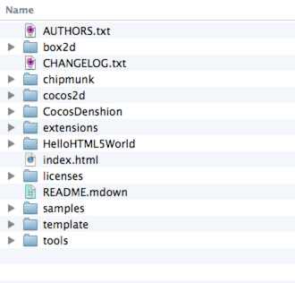

In the tutorial, I will show you how to setup a new cocos2d-html5 project from scratch. Before that, I want to
give you a brief description of cocos2d-html5's directory structures.

# Overview of cocos2d-html5 directory structures
Here is the cocos2d-html5 directory structure:

**Figure1**



##Understanding the directory structures

The directory structures can be separated into four parts:

### Part1: engine related folders

- The **cocos2d** directory holds all the core engine files. The main components of cocos2d-html5 are implemented in these js files.

- The **CocosDenshion** directory holds all the audio engine related files.

- The **extension** directory holds some useful extension modules, such as EditBox, CocosBuilder Reader and CocoStudio Reader, etc. 

- The folder **box2d** and **chipmunk** are third party physics engine.

### Part2: tests,sample games and template

- The folder **HelloHTML5World** contains a simple **Hello World** sample. When you are new to cocos2d-htlm5, you may want to give it a try. It is the minimax skeleton of a full cocos2d-html5 app.

- The **template** is more or less the same as **HelloHTML5World** except for that **template** is more clean. **Template**  folder is where you should start from. At the end of part of this tutorial, we will create a new project based on this folder.

- The **samples** directory, it contains all the **tests** of cocos2d-html5. It also includes some playable sample games. All the tests and games can be run in iOS and android with javascript binding. 

### Part3: miscellaneous

- The **license** directory includes all the license files in this project, as we mentioned before, the license of Cocos2d-html5 is MIT,you can refer to the folder to get more details about the licenses of cocos2d-html5.

- The **tools** directory includes JS Doc tool and closure compiler. The **template** folder contains a build.xml which is a config file for closure compiler, you can package your game into single file via Ant. 


# Taking a look at the built-in examples

When you have downloaded and configured your Cocos2d-html5 development environment successfully. It is highly recommended you to take a look at the built-in examples. It covers over 95% features of Cocos2d-html5. And it is also the most valuable learning resource that you can get currently. 

When you debug the index.html file within WebStorm, it will open the index.html file in Chrome and you will get the following result:

**Figure 2**


As we can see, there are many demos and sample games. If you are curious about what Cocos2d-html5 can do , prepare a coffee, sit down and take a look at the built-in sample games. 

## Taking a Look at the Tests
In Figure 2, when you open the link named “Test cases”. It will show you the entire tests built-in with Cocos2d-html5. Here is the screenshot:

**Figure 3**


The tests are the best learning resources for you. The tests show nearly every features of Cocos2d-html5. You can tweak these tests files and you will get feedback immediately after refresh browser. It is better to have a taste of Cocos2d-html5 this way than reading a huge documentation at the very beginning.


## Taking a Look at the Sample Games

There are 2 types of full game samples built-in with Cocos2d-html5. All of the source code are completely free and open to you. Here is a brief introduction about these sample games

### MoonWarrior

The first game I would like to show you is MoonWarrior. It is a vertical shooting game. In this game sample, many useful game techniques are applied, including tile-map, animation, parallax background etc. Here is the screenshot, you can dive into the source code for more information:

**Figure 4**


### Fruit Attack

This is a matching game. You can swap the position of the nearby fruit, if there are three or more same type fruits in vertical direction or horizontal direction. You are getting a match. And the same fruits will be cleared.  Here is the screenshot:

**Figure 5**


There are also other type games, you to try it by yourself.

# Setting up your first "Hello World" Project

Finally, we are reaching the final important part of this tutorial. Here I wil not really setup a "Hello World" project skeleton. I will take Parkour game as a example. In the future, all of these epic tutorials are about how to make a Parkour game with cocos2d-html5.

Can't help waiting? Let's do it right now!

## Making Parkour project skeleton

As we talked before, there is a **template** folder under cocos2d-html5 root directory. Right click the **template** folder and choose **Duplicate** to create a copy of it. Then modify the **Template Copy** folder to **Parkour**.

Now open your WebStorm and there will be a new directory in the previous Project Root. Now the project navigator looks like this:

**Figure 6**


Right click the **index.html** in WebStorm and choose **Debug 'index.html(1)'. It will open your Chrome automatically and you have successfully seted up a new project. Cheers!

**Note:**

If the "Hello World" png file is not properly displayed in your browser. You can open main.js under Parkour and modify the following code line:

```
        cc.EGLView.getInstance().setDesignResolutionSize(designSize.width, designSize.height, cc.RESOLUTION_POLICY.NO_BORDER);

```

to

```
        cc.EGLView.getInstance().setDesignResolutionSize(designSize.width, designSize.height, cc.RESOLUTION_POLICY.SHOW_ALL);

```


## Sample game template code analysis


## Makeing Some tweaks of the project

# Summary

# Where to go frome here?
